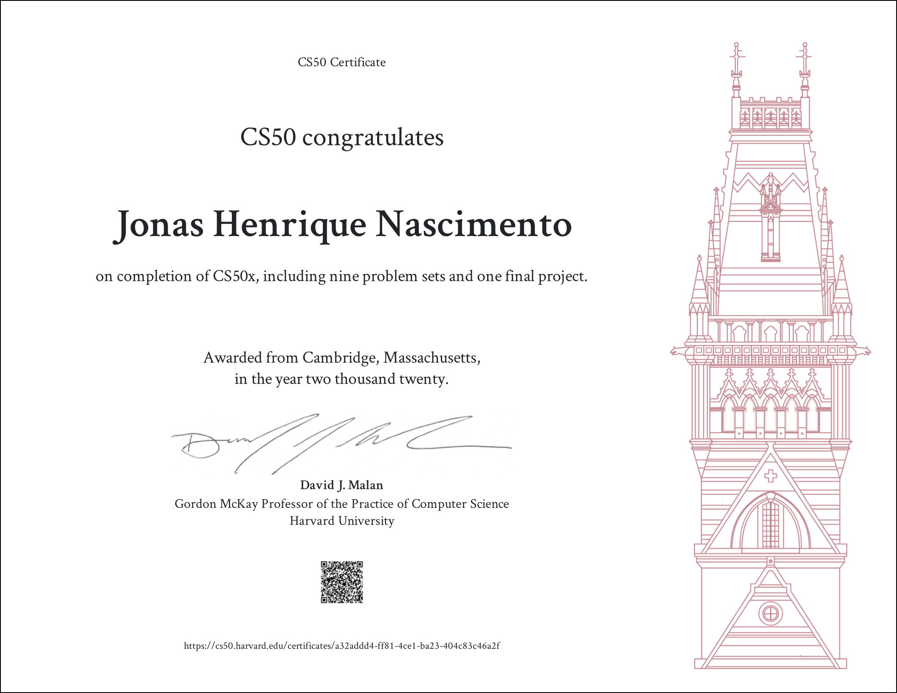

## Todos os exercícios resolvidos do curso CS50 de Harvard.

Separado por: Semana, linguagem, nome de cada um:  
Mais detalhes consultar o README de cada exercício.
 

- [x] PSET 1 - C
    * Hello
    * cash
    * mario-less

- [x] PSET 2 - C
    * readability
    * substitution

- [x] PSET 3 - C
    * plurality
    * runoff

- [x] PSET 4 - C
    * filter
    * recover

- [x] PSET 5 - C
    * speller

- [x] PSET 6 - Python
    * Hello
    * mario-more
    * cash
    * readability
    * DNA

- [x] PSET 7 - SQL
    * Movies
    * Houses

- [x] Tracks: Games
    * Pong
    * Mario

- [x] Final project
    * Game Atari Brekout
    * Vídeo de apresentação
    * Submissão do formulário

 

## Certificado

